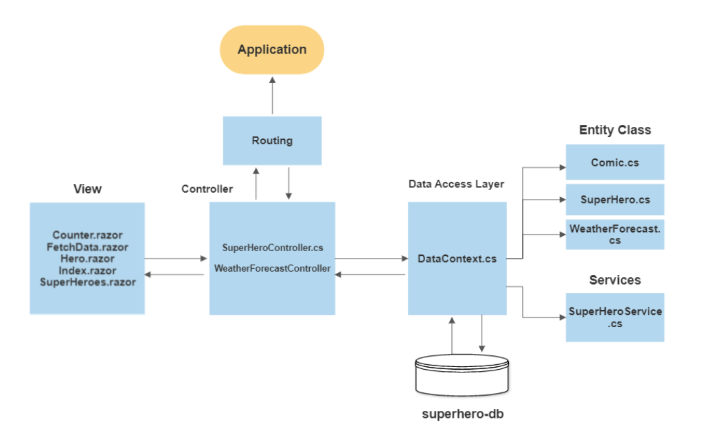

# BlazorApp

Blazor is a free and open-source web framework that enables developers to create web apps using C# and HTML. It is being developed by Microsoft.

## Architecture

## Documentation

### Razor pages

A Razor page is a standalone web page that contains both HTML markup and C# code, 
and is typically used to display and manipulate data.
 Razor Pages are a useful alternative to traditional MVC controllers that can contain code
  to redirect the client to a different URL or action method. 

### Routing

The Route attribute is an attribute used in ASP.NET MVC and ASP.NET Core to specify the 
route for a controller or action. When applied to a controller class, the Route attribute 
specifies the base route for all actions in the controller. When applied to an action method,
 the Route attribute specifies the route for that specific action

 #### Example:
 

    [Route("api/[controller]")]
    [ApiController]
    public class SuperHeroController : ControllerBase
         {
                  //action method go here
         }

### Controller

⦁	SuperHeroesController : 

Controller contain Action methods:These are methods that are called in response to specific
requests from clients. Each action method typically represents a specific task or operation that the controller can perform.
In SuperHeroesController collect data list from SuperHero.cs Entity class.

⦁	 WeatherForecastController:

  ‘WeatherForecastController’ this controller is used to display weather forecast information to users. 

### Date Access Layer:

⦁	DataContext.cs:
DataContext.cs class contains the Dbset of SuperHeroes and comics Classes.
And The Index action method retrieves the database list from SuperHeroes and comics classes.and perform the operation on that database.

###	Entity Classes :

-	Comics.cs
-	SuperHero.cs
-	WeatherForecast.cs

### Services:

SuperHeroService.cs: 
The ‘SuperHeroServices’ class provides a ‘CreateHero’ async method to create user  data 
from an external API.

### Database (superhero-db):

In superhero-db is used to store and retrieve data that is used by the application.
Database  is totally considered to be part of Model Layer.
Model layer communicates with the database through the Data Access Layer.
i.e, DataContext.cs.

